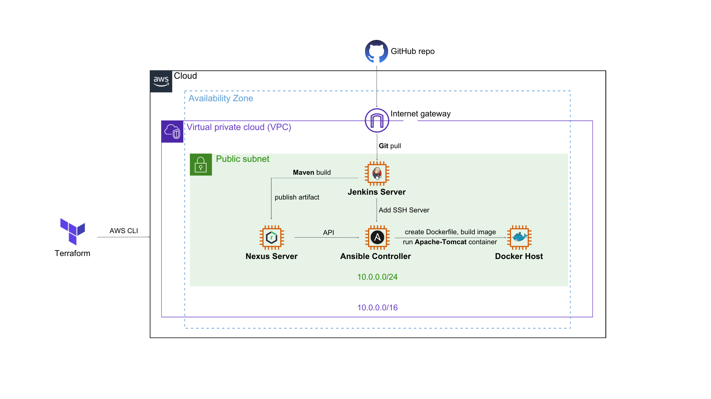

<h1 align="center">
  <br/>
  CI/CD Pipeline for Java Webapp
</h1>
<p align="center">Create a <b>Continuous Integration/Continuous Deployment</b> pipeline to deploy a simple Java web application.<br/>Focus on automation of the process for <b>DevOps</b>.</p>

<p align="center"><a href="https://www.terraform.io/" target="_blank"></a>&nbsp;<a href="https://www.jenkins.io/" target="_blank"></a>&nbsp;<a href="https://www.ansible.com/" target="_blank"></a>&nbsp;<a href="https://www.docker.com/" target="_blank"></a>&nbsp;<a href="https://aws.amazon.com/" target="_blank"></a></p>

<p align="center">
    <b>LANGUAGE</b>
</p>
<p align="center">
    <a href="README.md"></a>
    <a href="README-vi.md"></a>
</p>

## 💝 Source

GitHub: https://github.com/vinaysdevopslab/MyLab <br>
Udemy Course: https://www.udemy.com/course/devops-iac-cicd/

## ⚡️ Overview

CI/CD pipeline with Jenkins includes these tasks:
- Pull web app source code, Jenkinsfile, Ansible playbook, Ansible inventory to Jenkins Server from GitHub.
- Install & build artifacts with Maven on the Jenkins server.
- Publish artifacts to the Nexus repository in the Nexus server.
- Use Ansible to download the latest artifacts in the Nexus repository to the Docker host and deploy them on the Docker container.

## 📖 Project Structure

```
cicd-pipeline-java-webapp/
├── src/main/webapp
├── userdata/
├── .gitignore
├── Jenkinsfile
├── README.md
├── download-deploy.yaml
├── hosts
├── main.tf
├── variables.tf
└── pom.xml
```

## ⚙️ Provisioning Infrastructures on AWS with Terraform

You will need:
- The [Terraform CLI](https://developer.hashicorp.com/terraform/tutorials/aws-get-started/install-cli) (1.2.0+) installed.
- The [AWS CLI](https://docs.aws.amazon.com/cli/latest/userguide/getting-started-install.html) installed.
- [AWS account](https://aws.amazon.com/free) and [associated credentials](https://docs.aws.amazon.com/IAM/latest/UserGuide/security-creds.html) that allow you to create resources.

>🔔 In Windows, make sure that you add the path of the TF CLI and AWS CLI executable to your PATH environment variable so that you can run from any directory on your laptop/computer. 

Open the terminal and run

```
aws configure
```

You will need to input:
```
AWS Access Key ID
AWS Secret Access Key
Default region name
Default output format 
```

Copy 2 files `main.tf`, `variables.tf`, and folder `userdata/` of this Github repo to your working directory. Run the following commands to start provisioning:
> Before running terraform, login to the AWS console and create the keypair name `ec2`. If you want to use other keypairs, make sure to update this keypair name in `resource "aws_instance" {key_name}` of `main.tf`

```
terraform init
terraform plan
terraform apply --auto-approve
```

> Please be aware that the Nexus server use `instance type: t2.medium` which doesn't qualify under [AWS free tier](https://aws.amazon.com/free/)

> To be simple, we will not assign static IPs (AWS EIP) for our servers in this lab. So be aware that the public IP will be changed if you restart the instance.

You can change `CIDRs`, `instance type`, `AMI`, and `Security Group ports` in `variables.tf`. Scripts in `userdata/` for installing [Jenkins](/userdata/InstallJenkins.sh), [Nexus](/userdata/InstallNexus.sh), [Ansible](/userdata/InstallAnsibleController.sh), [Docker](/userdata/InstallDocker.sh).

> These installing scripts are written for AMI `Amazon Linux 2 AMI (HVM) - Kernel 5.10, SSD Volume Type`.

### Created AWS Resources

4 EC2 instances with public IP addressed & internet connectivity.


SG allow inbound ports: `22`, `443`, `80`, `8081`, `8080`
> You can create specific SG with the necessary ports for each EC2 instance instead of combining these ports in 1 SG.

### User account and SSH Configuration

All provisioned EC2 use the same keypair `ec2` which is manually created on the AWS console, you can use it to SSH remote EC2 CLI later. 

`Jenkins Server` and `Nexus Server` use the default user of AWS EC2: **ec2-user**. For `Ansible Controller` and `Dockerhost`, you will notice these configurations in [Ansible](/userdata/InstallAnsibleController.sh) and [Docker](/userdata/InstallDocker.sh) userdata scripts:

```
# Add user ansible admin
useradd ansibleadmin

# Set password: the below command will avoid re-entering the password
echo "ansibleadmin" | passwd --stdin ansibleadmin

# Modify the sudoers file at /etc/sudoers and add entry
echo 'ansibleadmin  ALL=(ALL)   NOPASSWD: ALL' | tee -a /etc/sudoers
echo 'ec2-user ALL=(ALL) NOPASSWD: ALL' | tee -a /etc/sudoers

# Enable Password Authentication
sed -i 's/PasswordAuthentication no/PasswordAuthentication yes/g' /etc/ssh/sshd_config
systemctl restart sshd
```

Use a specific user account for Ansible (**ansibleadmin**) in the Ansible Controller and this Managed Node. This practice could help us limit the privileges of that account to only what is necessary for Ansible or tracking Ansible activity.

Enable `PasswordAuthentication` for SSH will help us grant SSH access easier between `Jenkins Server`, `Ansible Controller`, and `Docker host` (Ansible managed node).

That's all you need to know to start! 🎉


## 📝 Create Jenkins pipeline

### Setup first-time use

Open `http://[Your Jenkins-Server Public IPv4]:8080` on web browser


Follow the instructions to get the initial Administrator password by run
`sudo cat /var/lib/jenkins/secrets/initialAdminPassword` on Jenkins-server CLI.

Install suggested plugins for Jenkins


After installation, create your Jenkins account and domain configuration. We can start using Jenkins


### Create job

Click `+ New Item` or `Create a job`, enter the name (**JavaWeb**) and choose `Pipeline`. Then click `OK`:


Scroll down to the `Pipeline` section. 
- In `Definition`, select `Pipeline script from SCM` (We will pull Jenkinsfile from Source Code Management instead of typing in Jenkinsfile context directly in this pipeline)
- In `SCM`, select `Git` (Suggested plugin we have installed contains the Git plugin, allowing us to poll, fetch, checkout, and merge contents of git repositories.)
- In `Repository URL`, paste your Github repo URL <br/>

>We check out our public repository with HTTPS so leave `Credentials` as `- none -`.
- In `Branch Specifier (blank for 'any')`, change to `*/main`

Click `Apply` and `Save`

> When running the pipeline, the Jenkins will clone your git repository to the workspace path on the agent machine which runs the pipeline. In this case, the workspace path will be `/var/lib/jenkins/workspace/[Job name]` on Jenkins server EC2 instance.

### Explain Jenkinsfile

#### Maven build
To use Maven to build artifacts from Java source code, we need to install Maven plugin. Go to `Manage Jenkins` > `Manage Plugins` > `Available plugins`, search and install `Maven Integration`:


After installing successfully, go to `Manage Jenkins` > `Global Tool Configuration`. Click `Add Maven`, and enter `Name`. (You can select other versions of Maven if you want)

Click `Apply` and `Save`

These lines below in Jenkinsfile will configure pipeline install Maven (`maven` in `''` is your `Name` you input in `Global Tool Configuration`)
```
tool {
  maven 'maven'
}
```
and use the command `mvn clean install package` to build a Java project:
```
stages {
        stage('Build') {
            steps {
                sh 'mvn clean install package'
            }
        }
        ...
}
```

#### pom.xml
As you can see, there is a `pom.xml` file in the GitHub repository. We will define some information for our build artifact and update the version every time we want to update our project here. You can find more information about POM [here](https://maven.apache.org/guides/introduction/introduction-to-the-pom.html#).

```
<project xmlns="http://maven.apache.org/POM/4.0.0" xmlns:xsi="http://www.w3.org/2001/XMLSchema-instance"
  xsi:schemaLocation="http://maven.apache.org/POM/4.0.0 http://maven.apache.org/maven-v4_0_0.xsd">
  <modelVersion>4.0.0</modelVersion>
  <groupId>com.mylab</groupId>
  <artifactId>MyLab</artifactId>
  <packaging>war</packaging>
  <version>0.0.1</version>
  <name>MyLab</name>
  <url>http://maven.apache.org</url>
  <dependencies>
    <dependency>
      <groupId>junit</groupId>
      <artifactId>junit</artifactId>
      <version>4.13.1</version>
      <scope>test</scope>
    </dependency>
  </dependencies>
  <build>
    <finalName>${project.artifactId}-${project.version}</finalName>
  </build>
</project>
```

To print this artifact information when we update and run the pipeline, we will use environment variables in Jenkinsfile to get context from the `pom.xml` file dynamically.
Install the plugin `Pipeline Utility Steps`:


In `Jenkinsfile`, these lines will get context from `pom.xml` of the repository:
```
environment {
        ArtifactId = readMavenPom().getArtifactId()
        Version = readMavenPom().getVersion()
        GroupId = readMavenPom().getGroupId()
        Name = readMavenPom().getName()
    }
```

and print out when running the pipeline:
```
stage('Print Environment variables') {
            steps {
                echo "Artifact ID is '${ArtifactId}'"
                echo "Group ID is '${GroupId}'"
                echo "Version is '${Version}'"
                echo "Name is '${Name}'"
            }
        }
```

#### Publish artifacts to the Nexus repository

We will need to store the `RELEASE`/`SNAPSHOT` version every time we update the source code of java web. Here is how we do that using **Sonatype Nexus**

**Setup on Nexus-Server**

Open `http://[Your Nexus-Server Public IPv4]:8081` on a web browser. Click `Login` in the upper-right corner.

Follow instructions to get the initial admin password by run
`sudo cat /opt/sonatype-work/nexus3/admin.password` on Nexus-server CLI.


Continue to set up new passwords for first-time use. Choose `Enable anonymous access`.
In this instruction, my `Nexus account` is **admin** with password **admin**

> By default, Nexus has already provided us with two repo `maven-releases` and `maven-snapshots`. You can skip these steps below if you want to use the default repo. Just make sure to remember these names to declare in the `Jenkinsfile`

Click on `Gear icon ⚙️` on the top bar, then select `Repositories` on the left-hand side. Choose `Create repository`


Select Recipe: `maven2 (hosted)`


Enter name: `MyLab-RELEASE` and choose `What type of artifacts does this repository store?` is `Release`


Repeat these steps above to create another repo with the name: `MyLab-SNAPSHOT` and choose `What type of artifacts does this repository store?` is `Snapshot`


Return to your `Nexus Browser` tab and the result should be like that:


**Setup on Jenkins-Server**

Our goal is to set up the Jenkins pipeline to publish the maven build artifact to the corresponding Nexus repo. 
First, we need to `Add Credentials` to access `Nexus repositories`.
- Kind: `Username with password`
- Username: **admin**
- Password: **admin**
- ID: **nexus**


Click `Create`


Then, install the `Nexus Artifact Uploader` plugin on Jenkins:


After installing the plugin. Open our created Jenkins pipeline, which is `JavaWeb` as I named it before. On the left-sidebar, select `Pipeline Syntax` > `Snippet Generator` to generate the syntax of `Jenkinsfile`. Choose `Sample Step` is `nexusArtifactUploader: Nexus Artifact Uploader`


- Nexus Version: `NEXUS3`
- Protocol: `HTTP`
- Nexus URL: `[Your Nexus-Server Public IPv4]:8081`
- Credentials: select your nexus credential you just created in previous step.
- GroupId: **${GroupId}**
- Version: **${Version}**
- Repository: **${NexusRepo}**

- Artifacts: click `Add`. 

> We use these `${environment variable}` instead of hard code to update information in `pom.xml` dynamically.

Click `Generate Pipeline Script`, and we will have:


Copy this syntax to your `Jenkinsfile` then return to `Dashboard`. Here is my `Nexus stage` syntax in `Jenkinsfile`:

```
stage('Publish to Nexus') {
            steps { 
                script {
                    def NexusRepo = Version.endsWith("SNAPSHOT") ? "MyLab-SNAPSHOT" : "MyLab-RELEASE"
                    
                    nexusArtifactUploader artifacts: 
                    [
                        [
                            artifactId: "${ArtifactId}", 
                            classifier: '', 
                            file: "target/${ArtifactId}-${Version}.war", 
                            type: 'war'
                        ]
                    ], 
                    credentialsId: 'nexus', 
                    groupId: "${GroupId}", 
                    nexusUrl: '10.0.0.48:8081', 
                    nexusVersion: 'nexus3', 
                    protocol: 'http', 
                    repository: "${NexusRepo}", 
                    version: "${Version}"
                }
            }
        }
```

>`def NexusRepo = Version.endsWith("SNAPSHOT") ? "MyLab-SNAPSHOT" : "MyLab-RELEASE"` used to select `Nexus repo` based on `version` in the `pom.xml` file. 

> In case we want to backup our artifact instead of release, just add `SNAPSHOT` at `<version>` in file `pom.xml`. Example: `<version>`0.0.1-SNAPSHOT`</version>`

#### Configure Ansible Controller to Jenkins pipeline.
The deployment stage in the pipeline will use Ansible. Before that, we need to add a Credential for `Jenkins Server` access to `Ansible Controller`.

Go to `Manage Jenkins` > `Plugin Manager`, search `Publish Over SSH` plugin on Jenkins Server and choose `Download now and install after restart`


After installing successfully, go to `Manage Jenkins` > `Configure System`. Scroll down to the bottom at section **SSH Servers**, click `Add`:
- Name: **ansible-controller**
- Hostname: **[Your Ansible Controller Private IP]**
- Username: **ansibleadmin**
- Remote Directory: **/home/ansibleadmin**

Click `Advanced` and check `Use password authentication, or use a different key`
- Passphrase / Password: **ansibleadmin**

Scroll down and click `Test Configuration`, it should show `Success` as below


Click `Apply` and `Save`.

> Our goal is to transfer `ansible playbook files`, `ansible inventory files` on `Jenkins-Server` to `Ansible-Controller` and run it by `Ansible CLI`

Open our created Jenkins pipeline `JavaWeb` again. On the left-sidebar, select `Pipeline Syntax` > `Snippet Generator` to generate the syntax of `Jenkinsfile`. Choose `Sample Step` is `sshPublisher: Send build artifacts over SSH`.

- Name: select `ansible-controller`
Transfer Set:
- Source files: `download-deploy.yaml, hosts`
- Remote directory: `/playbooks` (this directory on `Ansible-Controller` will be created to store source files transfer from `Jenkins-Server`)
- Exec command: ``cd playbooks/ && ansible-playbook download-deploy.yaml -i hosts``

Click `Generate Pipeline Script`, and we will have:


Copy this syntax to your `Jenkinsfile` then return to `Dashboard`. Here is my `Deploy stage` in `Jenkinsfile`:

```
stage('Deploy to Docker') {
            steps {
                echo 'Deploying...'
                sshPublisher(publishers: 
                [sshPublisherDesc(
                    configName: 'ansible-controller', 
                    transfers: [
                        sshTransfer(
                            sourceFiles: 'download-deploy.yaml, hosts',
                            remoteDirectory: '/playbooks',
                            cleanRemote: false,
                            execCommand: 'cd playbooks/ && ansible-playbook download-deploy.yaml -i hosts', 
                            execTimeout: 120000, 
                        )
                    ], 
                    usePromotionTimestamp: false, 
                    useWorkspaceInPromotion: false, 
                    verbose: false)
                ])
            }
        }
```

✌️ Our [Jenkinsfile](./Jenkinsfile) is completed!

## 🚚 Continuous Deployment with Ansible

### Manual configure SSH Credentials between `Ansible-Controller` and `Dockerhost`

Remote SSH to `Ansible-Controller` with account **ansibleadmin**, password **ansibleadmin**:
```
ssh ansibleadmin@[Your Ansible-Controller Public IP]
...
ansibleadmin@52.91.160.84's password:
```

Generate ssh keypair by running the command `ssh-keygen`
```
[ansibleadmin@ip-10-0-0-237 ~]$ ssh-keygen
Generating public/private rsa key pair.
Enter file in which to save the key (/home/ansibleadmin/.ssh/id_rsa): 
Created directory '/home/ansibleadmin/.ssh'.
Enter passphrase (empty for no passphrase): 
Enter same passphrase again: 
Your identification has been saved in /home/ansibleadmin/.ssh/id_rsa.
Your public key has been saved in /home/ansibleadmin/.ssh/id_rsa.pub.
The key fingerprint is:
SHA256:LwV0cZlxt2qyX7zu6uVygLfrnXQfDNDK0PIeCNAshpg ansibleadmin@ip-10-0-0-237.ec2.internal
The key's randomart image is:
+---[RSA 2048]----+
|  o ..o . o.o+. .|
| E . o.+ ...+. ..|
|    . ...o o . . |
|        ..* o .  |
|        S..*.+   |
|         o..=o+  |
|        . .o. oB.|
|         .  .o*.*|
|            o*BB.|
+----[SHA256]-----+
```

Then, run the command `ssh-copy-id ansibleadmin@[Your Dockerhost Private IP]` to copy the public key to the `Dockerhost`, allowing us to log in to the `Dockerhost` without having to enter the password.
```
[ansibleadmin@ip-10-0-0-237 ~]$ ssh-copy-id ansibleadmin@10.0.0.85
/usr/bin/ssh-copy-id: INFO: Source of key(s) to be installed: "/home/ansibleadmin/.ssh/id_rsa.pub"
The authenticity of host '10.0.0.85 (10.0.0.85)' can't be established.
ECDSA key fingerprint is SHA256:Zghtxh+5N5xRs4CgyXm7WEobMD18MF5bVhDLOE2EqTg.
ECDSA key fingerprint is MD5:03:8b:ee:bd:3f:bf:63:93:b5:49:f1:a8:6f:7b:7c:e8.
Are you sure you want to continue connecting (yes/no)? yes
/usr/bin/ssh-copy-id: INFO: attempting to log in with the new key(s), to filter out any that are already installed
/usr/bin/ssh-copy-id: INFO: 1 key(s) remain to be installed -- if you are prompted now it is to install the new keys
ansibleadmin@10.0.0.85's password: 

Number of key(s) added: 1

Now try logging into the machine, with:   "ssh 'ansibleadmin@10.0.0.85'"
and check to make sure that only the key(s) you wanted were added.
```

### Update ansible inventory

open file `hosts` in the Github repository, change the IP address under `[Dockerhost]` to `[Your Dockerhost Private IP]`

```
[dockerhost]
10.0.0.85
```

### Create ansible-playbook

Playbook file will instruct Ansible to perform these tasks on `Dockerhost`:
- Download the latest artifact from the Nexus repository release.
- Create Dockerfile to build an Apache-Tomcat image with the latest artifact.
- Build an image & run the container.

Check out my playbook file on the Github repo `download-deploy.yaml`.

##### Performing task on `Dockerhost` by declaring group name [dockerhost] in inventory file `hosts`:
```
  hosts: dockerhost
  become: true
```

##### Download the latest artifact from the Nexus release repo by using [Search API](https://help.sonatype.com/repomanager3/integrations/rest-and-integration-api/search-api).: 
```
curl -u [Nexus account]:[Nexus password] -L "http://[Your Nexus-Server Private IP]:8081/service/rest/v1/search/assets/download?sort=version&repository=[Nexus repository name]&maven.groupId=[groupID in pom.xml]&maven.artifactId=[artifactId in pom.xml]&maven.extension=[packaging in pom.xml]" -H "accept: application/json" --output /home/ansibleadmin/latest.war'
```

In ansible playbook file, it will look like this:

```
...
  tasks:
      - name: Download the war file
        shell: 'curl -u admin:admin -L "http://10.0.0.48:8081/service/rest/v1/search/assets/download?sort=version&repository=MyLab-RELEASE&maven.groupId=com.mylab&maven.artifactId=MyLab&maven.extension=war" -H "accept: application/json" --output /home/ansibleadmin/latest.war'
        args:
          chdir: /home/ansibleadmin
```

##### Create Dockerfile on `Dockerhost` to build an Apache-Tomcat image

We will use the image tomcat on [Dockerhub](https://hub.docker.com/_/tomcat) as our base image. Then copy the downloaded artifact to the root folder of the tomcat web server `/usr/local/tomcat/webapps`.
Finally, grant proper access and run the Tomcat server by `catalina.sh` script.
>`catalina.sh` is a shell script that is included with Apache Tomcat, and provides a number of options that can be used to customize the server's behavior.

The content of the Dockerfile will be like this:
```
FROM tomcat:latest
LABEL Author: "Minhung"
ADD ./latest.war /usr/local/tomcat/webapps
RUN chmod +x $CATALINA_HOME/bin
EXPOSE 8080
CMD ["catalina.sh", "run"]
```

In the ansible playbook, this task will be like this:

```
  tasks:
    ...
    - name: Create Dockerfile with content
      copy:
        dest: /home/ansibleadmin/Dockerfile
        content: |
                FROM tomcat:latest
                LABEL Author: "Minhung"
                ADD ./latest.war /usr/local/tomcat/webapps
                RUN chmod +x $CATALINA_HOME/bin
                EXPOSE 8080
                CMD ["catalina.sh", "run"]
```

##### Build the image and run the container in `Dockerhost`

Instead of running a shell script, using the ansible task with `force: yes` will rebuild the image, even if it already exists. (Ansible will add the `--no-cache=true` option to the `docker build` command)

```
  tasks:
    ...
    - name: Build an image
      docker_image:
        name: mylab-image
        path: /home/ansibleadmin
        force: yes
        state: present
```

For running a container, using the ansible task with `recreate: yes` will ensure that any existing container with the same name is stopped and removed before the new container is created. Our container will expose to port 8080 of `Dockerhost`.

```
  tasks:
    ...
    - name: Run the container
      docker_container:
        name: mylab-container
        image: mylab-image:latest
        state: started
        recreate: yes
        published_ports:
          - 0.0.0.0:8080:8080
```

So, we are completely creating a CI/CD pipeline for the Java web app!✌️ 


## ⭐️ Test the result

Open Jenkins, and run our pipeline. The result should be successful like that:


Open Nexus, and select our created release repository. The result should be like that:


Test our web app by enter `http://[Your Dockerhost Public IP]:8080/latest/` on web browser


Now, every time you change your Web app source code, just push to the GitHub repository and go to Jenkins pipeline and click `Build Now`. The new version of the web app will be deployed automatically.

> You can also automate the step click `Build Now` in Jenkins by going to `Configuration` in your pipeline. Select `Poll SCM` in the section `Build Trigger` and define the schedule. Click on the `?` sign to read the schedule instruction.

#### Troubleshooting

If your pipeline triggers an error, open `Console Output` of this `build #` to identify find which stage has the issue. 


Manual perform this step on the corresponding server to troubleshoot.

#### Clean up AWS Infrastructure

AWS resources will cost you per hour, so please remember to clean up after you finished.
Go to your working directory which is run `terraform` earlier, and run this command to clean up:
```
terraform destroy --auto-approve
```

Open AWS Console to verify again. 

*Good Luck!!!* 👏 👏 👏
